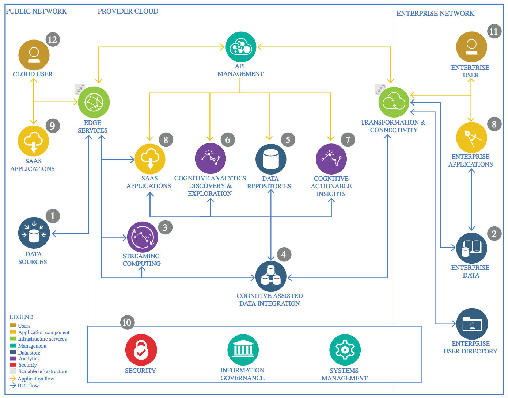

[The Lightweight IBM Cloud Garage Method for Data Science]{.underline}

Architectural Decisions Document Template

Architectural Components Overview
=================================

{width="6.263888888888889in"
height="4.9118055555555555in"}

Data Source
-----------

### Technology Choice

> Please describe what technology you have defined here. Please justify
> below, why. In case this component is not needed justify below.

Training data is provided in *CSV* format.
All data is provided in a single file, which has the following schema.

```
root
 |-- id: string (nullable = true)
 |-- keyword: string (nullable = true)
 |-- location: string (nullable = true)
 |-- text: string (nullable = true)
 |-- target: integer (nullable = true)
```

Data is accessed via the official *Kaggle* API. Access credentials are
stored in the object cloud and are retrieved when running the notebook.


### Justification

> Please justify your technology choices here.

Using the official API ensures access to the data in accordance to *Kaggle‘s*
usage policies.
Additionally, data can be accessed in a reproducable way and no input data
needs to be uploaded.

The *CSV* format is chosen, as it is the data format provided by *Kaggle*.

No realtime data access is needed during the training.

Enterprise Data
---------------

### Technology Choice

> Please describe what technology you have defined here. Please justify
> below, why. In case this component is not needed justify below.

No enterprise data is used in the project.

### Justification

> Please justify your technology choices here.

Enterprise data is not relevant to the use case.

Streaming analytics
-------------------

### Technology Choice

> Please describe what technology you have defined here. Please justify
> below, why. In case this component is not needed justify below.

At the moment, there are no plans to integrate streaming technology in
the project.
However, it might be interessting to stream new *Twitter* data for
classification in the future.

### Justification

> Please justify your technology choices here.

Training and test data is provided as fixed tables by *Kaggle*.

Data Integration 
-----------------

### Technology Choice

Please describe what technology you have defined here. Please justify
below, why. In case this component is not needed justify below.

### Justification

Please justify your technology choices here.

Data Repository
---------------

### Technology Choice

Please describe what technology you have defined here. Please justify
below, why. In case this component is not needed justify below.

### Justification

Please justify your technology choices here.

Discovery and Exploration 
--------------------------

### Technology Choice

Please describe what technology you have defined here. Please justify
below, why. In case this component is not needed justify below.

### Justification

Please justify your technology choices here.

Actionable Insights
-------------------

### Technology Choice

Please describe what technology you have defined here. Please justify
below, why. In case this component is not needed justify below.

### Justification

Please justify your technology choices here.

Applications / Data Products
----------------------------

### Technology Choice

Please describe what technology you have defined here. Please justify
below, why. In case this component is not needed justify below.

### Justification

Please justify your technology choices here.

Security, Information Governance and Systems Management
-------------------------------------------------------

### Technology Choice

Please describe what technology you have defined here. Please justify
below, why. In case this component is not needed justify below.

### Justification

Please justify your technology choices here.
